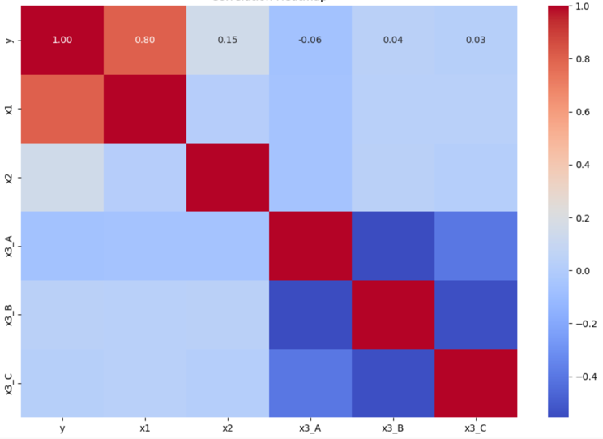
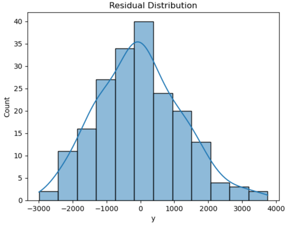
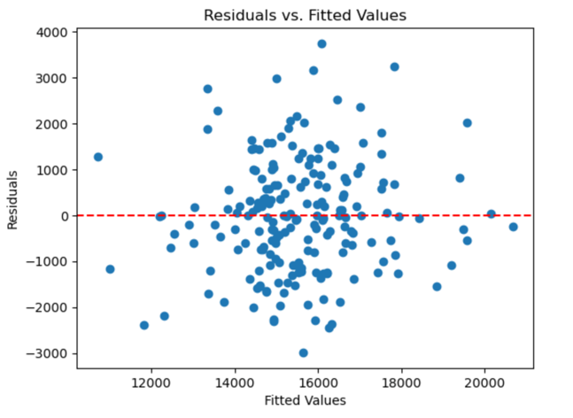
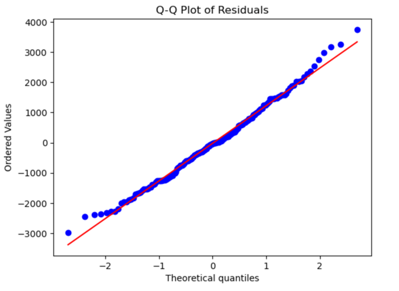
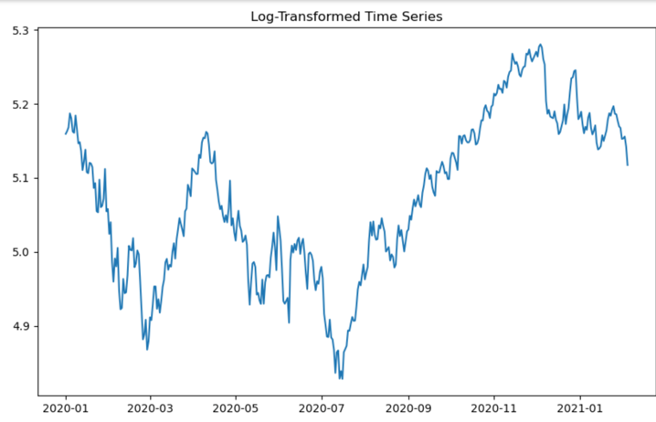
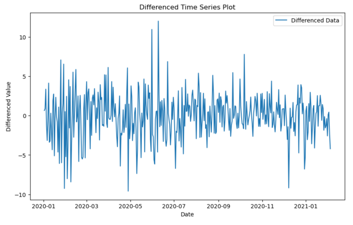
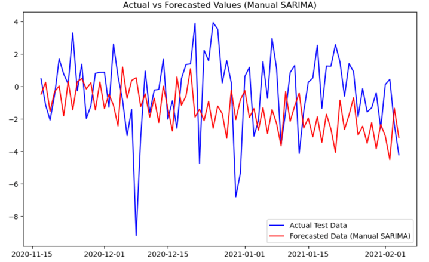

# Statistical Modelling & Time Series Forecasting

A statistical analytics project combining **Multiple Linear Regression (MLR)** and **Time Series Forecasting** to demonstrate predictive modelling, statistical diagnostics, model interpretation and forecasting techniques.

The project was completed as part of the **Statistics and Optimization** module of the MSc Data Analytics programme at the National College of Ireland.

---

## Project Overview

This project consists of two statistical modelling components:

1. **Multiple Linear Regression**
   - Predicting a continuous target variable using numerical and categorical predictors.
   - Evaluating statistical significance and model assumptions.
   - Performing regression diagnostics and predictive evaluation.

2. **Time Series Analysis**
   - Investigating trends, stationarity and seasonal behaviour.
   - Preparing non-stationary time-series data for modelling.
   - Applying ARIMA and Holt-Winters Exponential Smoothing.
   - Evaluating forecasting performance.

---

# Part 1: Multiple Linear Regression

## Objective

The regression analysis investigates whether the continuous target variable `y` can be predicted using:

- `x1` – numerical predictor
- `x2` – numerical predictor
- `x3` – categorical predictor with levels A, B and C

The dataset contains **1,000 observations**.

---

## Exploratory Data Analysis

Exploratory analysis was performed before modelling to understand the structure, distributions and relationships within the data.

The analysis included:

- descriptive statistics
- histograms
- scatter plots
- box plots
- correlation analysis
- relationship analysis between predictors and the target
- identification of potential outliers

The continuous variables were approximately normally distributed and no major missing-data problems were identified.

---

## Data Preparation

### Categorical Encoding

The categorical predictor `x3` was converted using one-hot encoding.

Two dummy variables were retained:

```text
x3_B
x3_C
```

Category A was used as the reference category to avoid perfect multicollinearity.

### Outlier Treatment

Potential extreme observations were identified using a **z-score threshold of ±3**.

Extreme observations were removed to reduce their influence on the regression coefficients.

### Train-Test Split

The prepared dataset was divided into:

```text
Training: 80%
Testing:  20%
```

A fixed random seed was used in the original analysis to support reproducibility.

---

## Final Regression Model

The final Multiple Linear Regression model used:

```text
y = f(x1, x2, x3_B, x3_C)
```

The model incorporates both numerical and categorical information.

The original analysis reported the following approximate coefficient interpretations:

| Predictor | Interpretation |
|---|---|
| x1 | A one-unit increase was associated with an average increase of approximately 288.01 units in y |
| x2 | A one-unit increase was associated with an average increase of approximately 66.46 units in y |
| x3_B | Category B was associated with approximately 83.64 fewer units than reference category A |
| x3_C | Category C was associated with approximately 12.39 additional units relative to category A |

---

## Regression Diagnostics

A major part of the project involved checking whether the final model satisfied the assumptions underlying Multiple Linear Regression.
## Regression Diagnostic Visualisations

### Correlation Analysis

The correlation heatmap was used to examine relationships between the numerical variables and identify their potential contribution to the regression model.



### Residual Distribution

The residual distribution was examined to assess whether the regression errors were approximately normally distributed.



### Residuals vs Fitted Values

The residual-versus-fitted plot was used to assess constant error variance. The residuals were distributed around zero without a strong systematic pattern.



### Q-Q Plot

The Q-Q plot provides an additional diagnostic check of residual normality.


### Linearity

Scatter plots and regression diagnostics were used to assess whether the numerical predictors had approximately linear relationships with the target.

### Independence of Errors

The Durbin-Watson statistic was approximately **2**, indicating no substantial residual autocorrelation.

### Homoscedasticity

Residual-versus-fitted plots were examined to determine whether residual variance remained approximately constant.

### Normality of Residuals

Residual histograms and Q-Q plots were used to assess normality.

### Multicollinearity

Variance Inflation Factor (VIF) analysis was performed on the predictors.

The reported VIF values remained below the threshold used in the project, indicating that problematic multicollinearity was not identified.

---

## Regression Performance

The final model produced:

| Metric | Result |
|---|---:|
| R² | **0.638** |
| Mean Squared Error | **1,532,916** |

An R² of **0.638** means that the model explained approximately **63.8% of the observed variation in the target variable `y`**.

The remaining variation suggests that additional predictors or alternative modelling approaches could potentially improve predictive performance.

---

# Part 2: Time Series Analysis

## Objective

The second component investigates statistical methods for analysing and forecasting time-dependent observations.

The workflow included:

```text
Raw Time Series
       ↓
Exploratory Analysis
       ↓
Stationarity Testing
       ↓
Transformation
       ↓
Differencing
       ↓
Forecasting Models
       ↓
Residual Diagnostics
       ↓
Forecast Evaluation
```

---

## Stationarity Analysis

The original time series was assessed for stationarity using the **Augmented Dickey-Fuller (ADF) test**.

The initial analysis indicated that the series was non-stationary.

To prepare the data for forecasting, the project applied:

- logarithmic transformation
- differencing
- reindexing to maintain consistent time intervals

The ADF test was then reapplied after transformation to assess whether stationarity had been achieved.

---
## Time Series Visualisations

### Log Transformation

A logarithmic transformation was applied as part of the preparation of the non-stationary time series.



### Differencing

Differencing was subsequently applied to reduce trend and obtain a more stationary series suitable for statistical forecasting.



### Forecast Evaluation

The final forecast was compared visually with the actual test observations to assess forecasting performance.


## ARIMA

**ARIMA (AutoRegressive Integrated Moving Average)** was used as one of the main forecasting approaches.

ARIMA is designed to model time-series behaviour using:

- autoregressive information
- differencing
- moving-average components

The original project also used automated parameter-selection techniques to support model configuration.

The analysis found ARIMA useful for capturing short-term behaviour and non-seasonal components of the series.

---

## Holt-Winters Exponential Smoothing

A second forecasting approach used **Holt-Winters Exponential Smoothing**.

This method explicitly models:

- level
- trend
- seasonality

The original analysis used an additive trend and seasonal structure.

The model was particularly useful for representing seasonal patterns in the time series.

---

## Forecast Evaluation

Forecasts were compared with actual test observations and residual behaviour was examined.

The reported evaluation metrics were:

| Metric | Result |
|---|---:|
| Mean Squared Error | **258.90** |
| Mean Absolute Error | **13.71** |

Residual analysis was also used to assess whether unexplained errors behaved approximately like white noise.

---

## Key Findings

### Multiple Linear Regression

The final regression model explained **63.8% of the variation** in the target variable.

Both numerical and categorical predictors contributed to the modelling process, while diagnostic testing was used to assess the assumptions required for reliable regression inference.

### Time Series Forecasting

The analysis demonstrated the importance of transforming non-stationary data before forecasting.

ARIMA and Exponential Smoothing provided complementary approaches:

- **ARIMA** was useful for autoregressive and non-seasonal behaviour.
- **Holt-Winters** was useful for modelling trend and seasonality.

The comparison demonstrates why forecasting methods should be selected according to the characteristics of the underlying time series.

---

## Technologies & Libraries

- Python
- Pandas
- NumPy
- Matplotlib
- Seaborn
- Scikit-learn
- Statsmodels
- SciPy
- pmdarima
- Jupyter Notebook
- Multiple Linear Regression
- ARIMA
- Holt-Winters Exponential Smoothing
- Augmented Dickey-Fuller Testing
- Statistical Diagnostics

---

## Repository Structure

```text
statistical-modelling-time-series/
│
├── data/
│   ├── mlr1.csv
│   └── README.md
│
├── notebooks/
│   ├── statistics-and-optimization.ipynb
│   └── README.md
│
├── screenshots/
│
├── README.md
├── requirements.txt
└── .gitignore
```

---

## Skills Demonstrated

This project demonstrates practical experience with:

- statistical modelling
- exploratory data analysis
- multiple linear regression
- categorical feature encoding
- statistical inference
- coefficient interpretation
- regression diagnostics
- residual analysis
- multicollinearity testing
- VIF
- time-series analysis
- stationarity testing
- data transformation
- ARIMA forecasting
- exponential smoothing
- forecast evaluation
- statistical model interpretation

---

## Reproducibility Note

The original dataset for the **Multiple Linear Regression** analysis is included:

```text
data/mlr1.csv
```

The original source dataset used for the **time-series analysis is no longer available** and therefore is not included in this repository.

The original notebook and project report preserve the methodology, modelling approach and reported time-series results.

No synthetic or replacement dataset has been introduced to recreate the missing source data.

---

## Academic Context

**Module:** Statistics and Optimization  
**Programme:** MSc Data Analytics  
**Institution:** National College of Ireland  
**Academic Year:** 2024–2025

**Original Project:** Multiple Linear Regression and Time Series Analysis

---

## Future Improvements

Potential extensions to the analysis include:

- testing additional regression predictors
- investigating interaction effects
- applying Ridge and Lasso regression
- comparing MLR with non-linear regression models
- performing cross-validation
- testing alternative ARIMA configurations
- evaluating SARIMA for seasonal forecasting
- comparing additional forecasting models
- investigating hybrid or ensemble forecasting approaches

---

## Portfolio Note

This repository reorganises the original academic analysis into a portfolio-friendly format.

The reported statistical results, methodology and conclusions are based on the original project materials. The repository focuses on demonstrating the complete analytical workflow from exploratory analysis and statistical modelling through diagnostics, forecasting and model evaluation.
